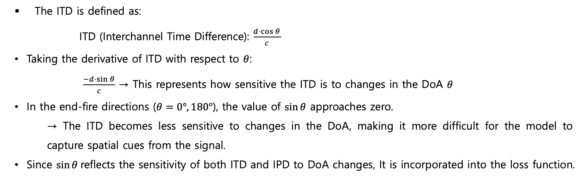
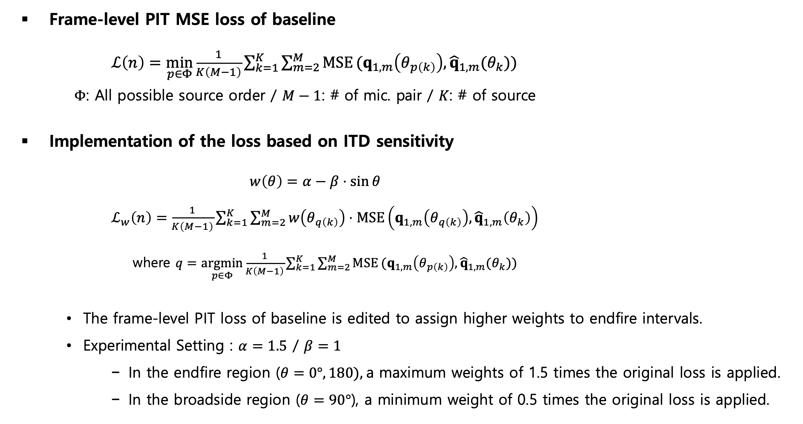
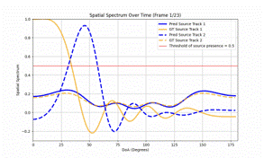
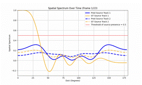
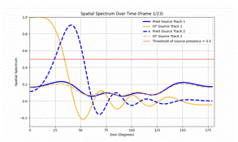
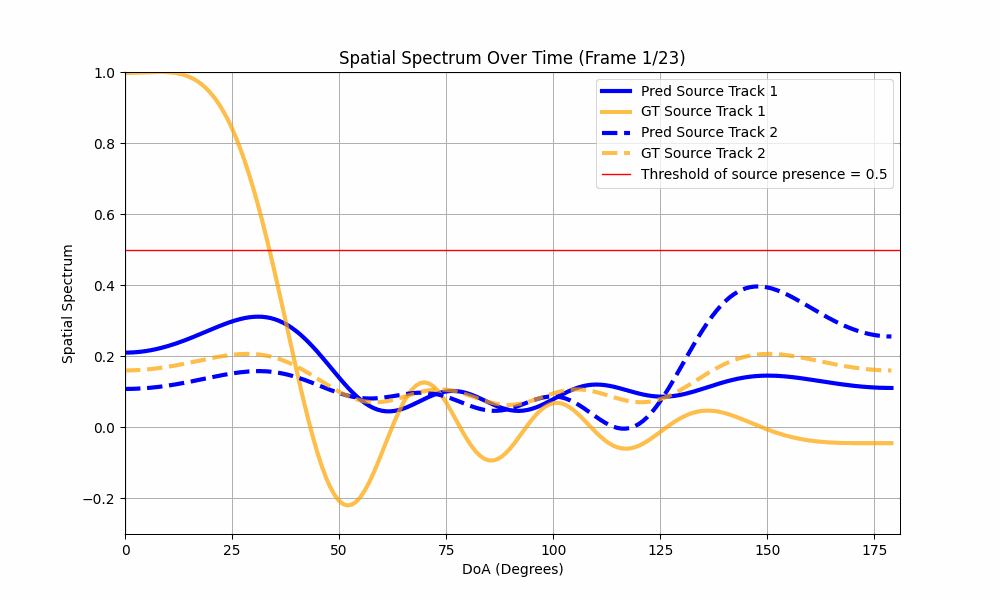

# End-fire Weighted Loss for IPDnet
## 🔍 Overview
- This study proposes an ITD sensitivity based loss to improve DoA estimation performance in the end-fire region.
 

## 💡 Motivation
- Most samples with low MAE (Mean Absolute Error) performance were located in the end-fire region (0°–20° / 160°–180°).
- To address the difficulty in DoA estimation in the end-fire region, a loss function is designed to assign higher weights to samples whose true DoA lies near the end-fire direction.

 

## ⭐ Method

 

## 📊 Result
| Method                       | Gross Accuracy [%] | Fine Error [°] |
|:----------------------------:|:-------------------------:|:--------------------:|
| IPDnet (Baseline)                  | 89.4                      | 2.05                 |
| IPDnet with End-fire weighted loss (Proposed) | **90.7**                  | **1.98**             |

Table 1.ㅣPerformance comparison between the baseline and the model with proposed method on the simulation dataset. Error Tolerance is set to 10°. 

| DoA interval     | (Baseline) Gross Accuracy [%] | (Baseline) Fine Error [°] | (Proposed) Gross Accuracy [%] | (Proposed) Fine Error [°] |
|:------------:|:----------------------------:|:------------------------:|:----------------------------:|:------------------------:|
| [0, 20)      | 77.7                         | 3.34                     | 82.7                         | 3.29                     |
| [20, 40)     | 87.6                         | 2.52                     | 90.1                         | 2.37                     |
| [40, 60)     | 87.7                         | **2.09**                 | 89.9                         | 2.10                     |
| [60, 80)     | 89.8                         | **1.69**                 | 90.6                         | 1.70                     |
| [80, 100)    | **90.1**                     | **1.41**                 | 89.8                         | 1.52                     |
| [100, 120)   | 88.0                         | 1.75                     | 89.2                         | 1.74                     |
| [120, 140)   | 88.6                         | 2.07                     | 89.9                         | 2.00                     |
| [140, 160)   | 88.8                         | 2.41                     | 90.7                         | 2.27                     |
| [160, 180)   | 75.8                         | 4.11                     | 81.4                         | 3.48                     |

Table 2.ㅣPerformance comparison between the baseline and the model with the proposed method across several DoA intervals. The DoA resolution is set to 20°. 

<table>
  <tr>
    <th></th>
    <th># of Source: 1</th>
    <th># of Source: 2</th>
  </tr>
  <tr>
    <td><b>IPDnet (Baseline)</b></td>
    <td></td>
    <td></td>
  </tr>
  <tr>
    <td><b>IPDnet with End-fire weighted loss</b></td>
    <td></td>
    <td></td>
  </tr>
</table>

Table 3.ㅣIllustration of spatial spectrums in baseline and proposed model. 

- Compared to the baseline, a significant improvement in DoA estimation accuracy is observed in the end-fire region, although there is a slight performance degradation in the broadside direction.
 

## 📚 Reference
[1] Wang, Yabo, Bing Yang, and Xiaofei Li. "IPDnet: A universal direct-path IPD estimation network for sound source localization." IEEE/ACM Transactions on Audio, Speech, and Language Processing (2024).
