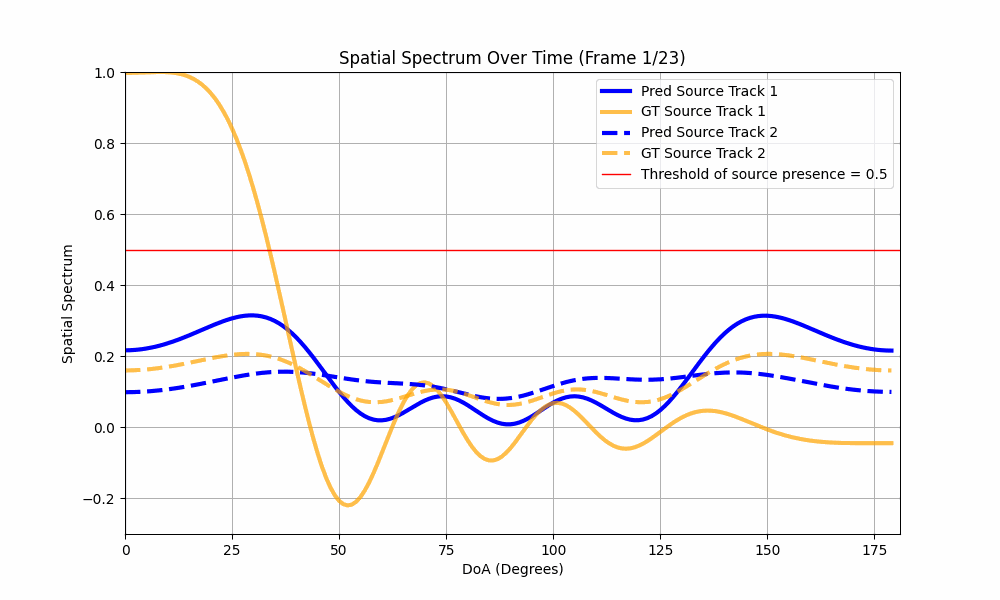
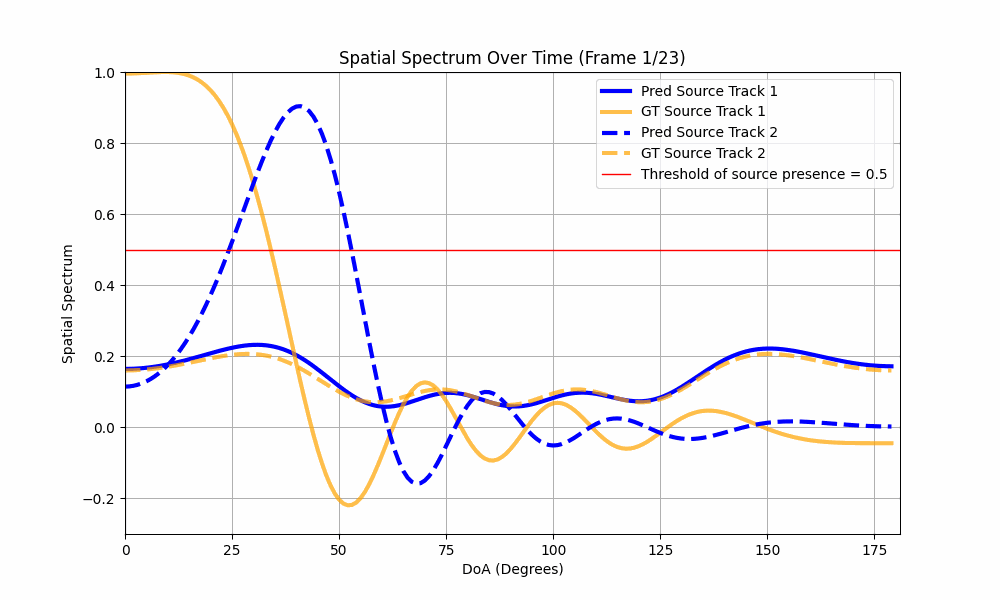

# Endfire-weighted Loss for IPDnet
## 🔍 Overview
- This study proposes a lightweight LSTM-based neural network for localizing multiple moving sources in noisy and reverberant environment
- A full-band and narrow-band fusion network is adopted as the backbone netowrk, which has recently emerged as a prominant research trend. 
 

## 💡 Motivation
- The backbone network requires high computational complexity as each individual narrow-band layer must processes full time frames across every frequency bin, resulting in substantial computational burden.
- While the parameter size in a deep-learning model primarily affects memory usage, the actual inference time and energy consumption are more significantly influenced by computational complexity.
- Reducing computational load enhances execution speed and reduces power consumption, making the model more suitable for mobile and embedded environments.
- Therefore, this work focuses on minimizing computational complexity rather than simply reducing parameter size.
 

## ⭐ Method
- To improve computational efficiency, the model incorporates down-sampling blocks composed of convolutional layers. These progressively compress the temporal dimension while extracting compact feature representations.
- The original skip connection method based on concatenation is replaced with summation to further reduce computation.
 

## 📊 Result
| Method                       | Gross Accuracy (10°) [%] | Fine Error (10°) [°] |
|:----------------------------:|:-------------------------:|:--------------------:|
| IPDnet (Baseline)                  | 89.4                      | 2.05                 |
| IPDnet with End-fire weighted loss (Proposed) | **90.7**                  | **1.98**             |

Table 1.ㅣPerformance comparison between the baseline and the lightweight model on the simulation dataset.

| DoA interval     | (Baseline) Gross Accuracy [%] | (Baseline) Fine Error [°] | (Proposed) Gross Accuracy [%] | (Proposed) Fine Error [°] |
|:------------:|:----------------------------:|:------------------------:|:----------------------------:|:------------------------:|
| [0, 20)      | 77.7                         | 3.34                     | 82.7                         | 3.29                     |
| [20, 40)     | 87.6                         | 2.52                     | 90.1                         | 2.37                     |
| [40, 60)     | 87.7                         | **2.09**                 | 89.9                         | 2.10                     |
| [60, 80)     | 89.8                         | **1.69**                 | 90.6                         | 1.70                     |
| [80, 100)    | **90.1**                     | **1.41**                 | 89.8                         | 1.52                     |
| [100, 120)   | 88.0                         | 1.75                     | 89.2                         | 1.74                     |
| [120, 140)   | 88.6                         | 2.07                     | 89.9                         | 2.00                     |
| [140, 160)   | 88.8                         | 2.41                     | 90.7                         | 2.27                     |
| [160, 180)   | 75.8                         | 4.11                     | 81.4                         | 3.48                     |

Table 1.ㅣPerformance comparison between the baseline and the lightweight model on the simulation dataset. (DoA resolution: 20°)

<table>
  <tr>
    <th></th>
    <th># of Source: 1</th>
    <th># of Source: 2</th>
  </tr>
  <tr>
    <td><b>IPDnet (Baseline)</b></td>
    <td></td>
    <td></td>
  </tr>
  <tr>
    <td><b>IPDnet with End-fire weighted loss</b></td>
    <td></td>
    <td></td>
  </tr>
</table>

- Experiments show that the proposed model reduces computational cost by up to 51% compared to the baseline, while achieving comparable localization performance in terms of Gross Accuracy and Fine Error.
- The results confirm that the proposed model maintains reliable localization performance even in low-resource environments.
 

## 📚 Reference
[1] Wang, Yabo, Bing Yang, and Xiaofei Li. "IPDnet: A universal direct-path IPD estimation network for sound source localization." IEEE/ACM Transactions on Audio, Speech, and Language Processing (2024).
[2] Stoller, Daniel, Sebastian Ewert, and Simon Dixon. "Wave-u-net: A multi-scale neural network for end-to-end audio source separation." arXiv preprint arXiv:1806.03185 (2018).
[3] Battula, Shanmukha Srinivas, et al. "Robust Frame-level Speaker Localization in Reverberant and Noisy Environments by Exploiting Phase Difference Losses." ICASSP 2025-2025 IEEE International Conference on Acoustics, Speech and Signal Processing (ICASSP). IEEE, 2025.
